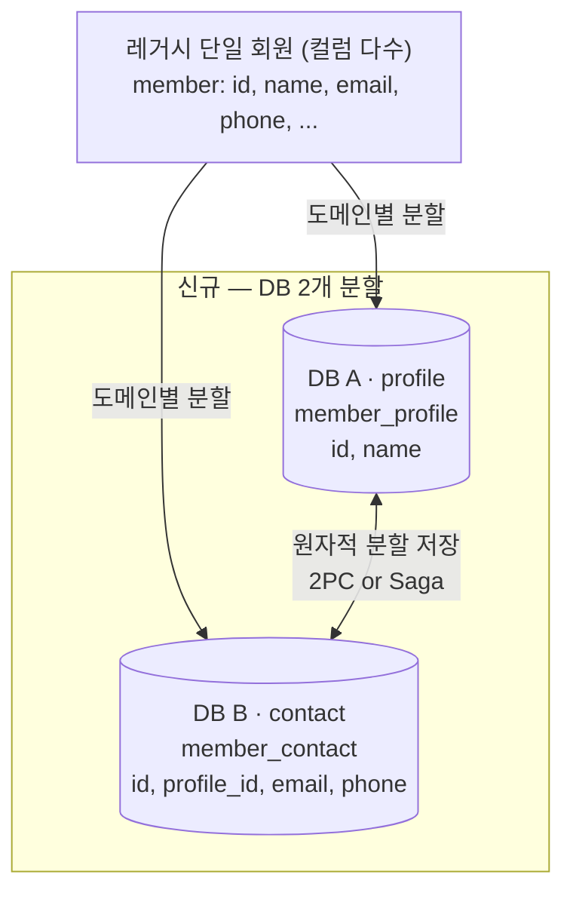
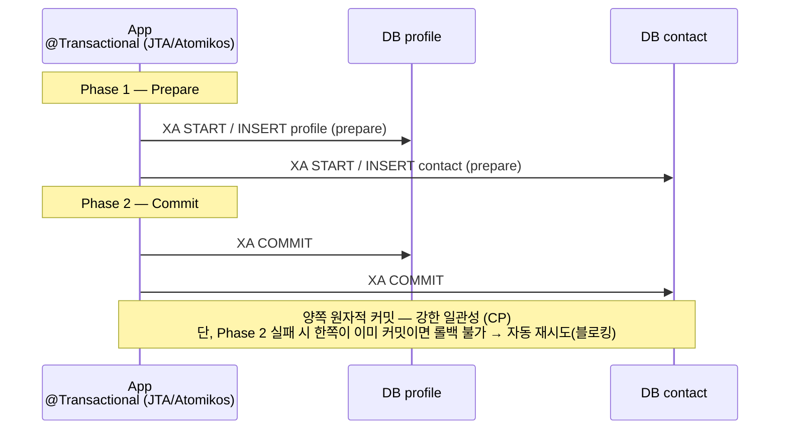
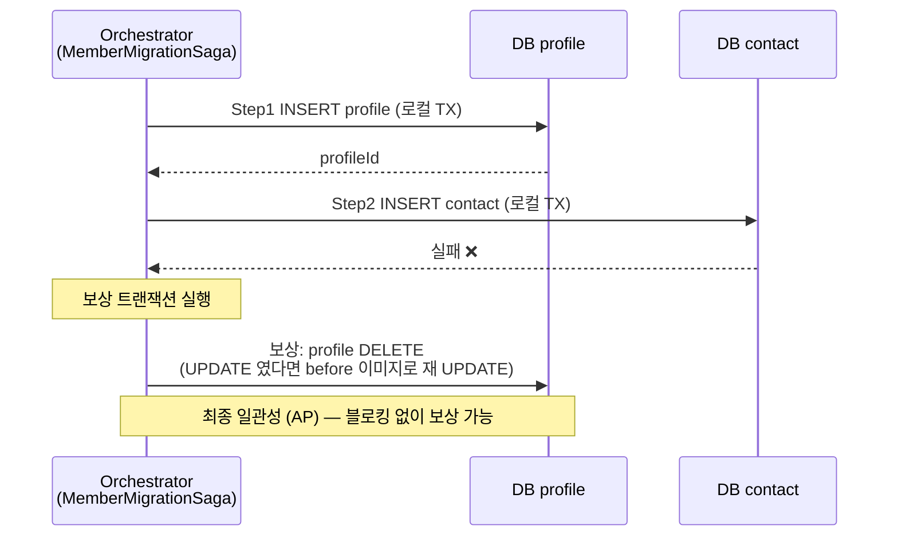

# distributed-tx-study

> **2PC → Saga 마이그레이션을 코드로 직접 구현·검증한 학습 프로젝트**

실제 회원 시스템 무중단 마이그레이션에서 겪은 **2PC(JTA/Atomikos)** 의 한계를 재현하고, 같은 시나리오를 **Saga(Orchestration)** 로 다시 설계해 비교한다.

| | |
|---|---|
| **스택** | Spring Boot 4 · Kotlin · JPA · Atomikos(JTA) · MySQL XA · Testcontainers |
| **검증** | ✅ `./gradlew test` — two-pc(MySQL XA) + saga(H2) 시나리오 전부 통과 |
| **핵심** | 2PC(강한 일관성, CP) ↔ Saga(최종 일관성, AP) 비교 · INSERT/UPDATE **보상 트랜잭션** 구현 |
| **DB 설치** | **불필요** (Testcontainers MySQL XA / H2) |

---

## 📑 목차

- [시나리오 (아키텍처)](#-시나리오--아키텍처)
- [핵심 흐름 — 2PC vs Saga (Mermaid)](#-핵심-흐름--2pc-vs-saga)
- [빠른 실행 + 결과](#-빠른-실행--결과)
- [모듈 & 파일 역할](#-모듈--파일-역할)
- [학습 경로 (테스트 읽는 순서)](#-학습-경로--테스트를-이-순서로-읽으면-단계적-학습)
- [테스트 도구](#-테스트-도구--상황에-따라-분리)
- [2PC vs Saga 비교표](#-2pc-vs-saga-비교)
- [학습 포인트 + 보상 종류](#-학습-포인트)
- [Lessons Learned (직접 부딪힌 함정)](#-lessons-learned-직접-부딪힌-함정)
- [왜 만들었나](#-왜-만들었나)

---

## 🎯 시나리오 — 아키텍처

레거시 단일 회원 테이블(컬럼 다수)을 **신규 DB 2개(profile/contact)로 도메인 분할**. 회원 1건을 두 DB에 나눠 저장할 때 **양쪽 쓰기의 원자성**을 2PC와 Saga 각각으로 구현한다.

> (레거시 → 신규 동기화는 CDC/DMS가 담당. 이 프로젝트는 **신규 DB 2개 사이 정합성**에 집중)



---

## 🔬 핵심 흐름 — 2PC vs Saga

### 2PC (two-pc) — Phase 1/2 로 양쪽 DB 원자적 커밋



### Saga (saga) — 로컬 TX + 보상 트랜잭션



---

## ⚡ 빠른 실행 + 결과

```bash
./gradlew test          # 전체 시나리오 (two-pc MySQL XA + saga H2)
```

**성공하면 아래처럼 모든 테스트가 통과한다:**

```
> Task :two-pc:test      # 2PC 정상 커밋 + 롤백 (Testcontainers MySQL XA)
> Task :saga:test        # Saga INSERT 정상/보상 + UPDATE 보상
BUILD SUCCESSFUL
```

> 처음 실행 시 Testcontainers가 MySQL 이미지를 받으므로 시간이 조금 걸린다. Docker가 실행 중이어야 함.

---

## 📁 모듈 & 파일 역할

```
distributed-tx-study/
├── common/      # 공통 도메인 모델 (Member, 보상용 Snapshot)
├── two-pc/      # 2PC — JTA(Atomikos)로 profile·contact 두 DB 원자적 쓰기 (CP)
└── saga/        # Saga — 각 DB 로컬 TX + 보상 트랜잭션 (AP)
```

| 파일 | 역할 | 보면 좋을 때 |
|------|------|------------|
| `two-pc/.../config/JtaConfig.kt` | Atomikos XA DataSource 2개 + EMF(`jta(true)`) + JTA TM | 2PC 설정이 궁금할 때 |
| `two-pc/.../service/MemberMigrationService.kt` | `registerMember` — 한 `@Transactional`로 두 DB 분할 저장 | 2PC 코드 핵심 |
| `saga/.../saga/MemberMigrationSaga.kt` | Orchestrator — Step1→2 + 실패 시 보상 | Saga/보상 흐름 |
| `saga/.../service/ProfileService.kt` | profile DB 로컬 TX + INSERT/UPDATE 보상(DELETE/before 재UPDATE) | 보상 트랜잭션 구현 |
| `two-pc/.../MemberMigrationServiceTest.kt` | 2PC 정상/롤백 (JUnit5 + Testcontainers MySQL XA) | 2PC 검증 |
| `saga/.../MemberMigrationSagaSpec.kt` | Saga INSERT 정상/보상 + UPDATE 보상 (Kotest BehaviorSpec) | Saga 검증 |

---

## 📚 학습 경로 (테스트를 이 순서로 읽으면 단계적 학습)

1. **`two-pc/MemberMigrationServiceTest`** (JUnit5 + Testcontainers MySQL XA)
   - `정상 흐름` → 2PC로 양쪽 DB 원자적 **커밋**
   - `롤백 흐름` → 비즈니스 예외 시 양쪽 DB **롤백**
2. **`saga/MemberMigrationSagaSpec`** (Kotest BehaviorSpec, Given/When/Then)
   - `① INSERT 정상` → Step1(profile)+Step2(contact) **COMPLETED**
   - `② INSERT 보상` → Step2 실패 → Step1 **보상(DELETE)**
   - `③ UPDATE 보상` → Step2 실패 → Step1 **before 이미지로 재 UPDATE**

---

## 🧪 테스트 도구 — 상황에 따라 분리

| 모듈 | 도구 | 이유 |
|------|------|------|
| **saga** | **Kotest BehaviorSpec** | 학습 시나리오를 `Given/When/Then`로 표현하기 좋음 (H2라 단순) |
| **two-pc** | **JUnit5 + Testcontainers** (`@DynamicPropertySource`) | 다중 DataSource(XA) URL을 컨테이너 시작 시점에 주입해야 해서 `@DynamicPropertySource`가 깔끔. (Kotest + Testcontainers + Spring 동적 프로퍼티 조합은 설정 과도) |

> "상황에 따라 도구를 선택한다" 자체가 실무 감각 — Kotest는 시나리오 표현에 좋지만, 인프라(Testcontainers) 주입이 핵심이면 JUnit5 `@DynamicPropertySource`가 더 적합.

---

## ⚖️ 2PC vs Saga 비교

| 구분 | **2PC** (two-pc) | **Saga** (saga) |
|------|------------------|-----------------|
| 일관성 | 강한 일관성 (Strong) | 최종 일관성 (Eventual) |
| 잠금 | 전역 리소스 잠금 (블로킹) | 없음 (각 단계 독립) |
| 실패 복구 | Phase 2 실패 시 **롤백 불가 → 자동 재시도(블로킹)** | **보상 트랜잭션**(profile INSERT→DELETE)으로 명확히 되돌림 |
| 코디네이터 | SPOF (Atomikos) | 분산 (Orchestrator) |
| 중간 상태 | 없음 (원자적) | 일시적 불일치 허용 (profile만 있는 구간) |
| CAP | CP | AP |
| 적합 | 강한 일관성 필수(계좌) | 가용성·장애 격리 중요(회원 동기화) |

---

## 🔍 학습 포인트

### two-pc (`MemberMigrationService`)
- `@Transactional`(JTA) 하나로 `profileRepo.save` + `contactRepo.save`가 **한 분산 트랜잭션**에 묶임
- `registerMemberThenFail` → contact 저장 직전 예외 → **두 DB 모두 롤백** (테스트로 검증)
- 핵심 한계: Phase 2 커밋 단계에서 한쪽이 이미 커밋된 뒤 다른 쪽이 실패하면 **되돌릴 수 없고**, Atomikos는 실패한 쪽에 COMMIT을 **자동 재시도(블로킹)** → 실제 운영에서 체감한 한계

### saga (`MemberMigrationSaga`)
- 각 단계가 **독립된 로컬 트랜잭션**(`profileTransactionManager` / `contactTransactionManager`)
- `Step 1(profile INSERT) → Step 2(contact INSERT)`; Step 2 실패 시 **Step 1 보상(profile DELETE)** (테스트로 검증)
- **UPDATE 보상** (`updateMemberNameAndEmail`): profile name UPDATE(before 이미지 보관) → contact email UPDATE, 실패 시 **before 이미지로 재 UPDATE** (테스트로 검증)
- 블로킹 없이 **보상 가능** → 일시적 중간 상태(profile DB에만 데이터)를 감수하는 대신 가용성·장애 격리 확보

### 보상 트랜잭션 종류 (★ 핵심)
| 정방향 | 보상 | 비고 |
|--------|------|------|
| **INSERT** | **DELETE** | 생성된 row 제거 (단순) |
| **UPDATE** | **before 이미지로 재 UPDATE** | 변경 전 값을 보관해두고 그 값으로 되돌림 (DELETE 불가) |
| **DELETE** | (보상 불가) | 취소 불가능한 연산 → 가장 마지막 단계에 배치 |

---

## 🧗 Lessons Learned (직접 부딪힌 함정)

Spring Boot 4 + Hibernate 7 + Atomikos 6 + MySQL XA 매트릭스에서 **2PC 테스트가 동작하기까지** 만난 문제와 해결:

### 1. Hibernate가 JTA 글로벌 TX에 참여하지 않는 문제 (insert 자체가 안 됨)
- **원인**: 다중 DataSource라 **Boot JPA auto-config가 `EntityManagerFactoryBuilder` 빈을 생성하지 않음**(백오프). `LocalContainerEntityManagerFactoryBean` 직접 생성으로 대체하면 `.jta(true)`가 빠져 Hibernate가 JTA TX에 참여하지 못함 → persist/flush/insert가 아예 발생 X
- **해결**: `EntityManagerFactoryBuilder`를 **`@Bean`으로 직접 생성**하고 `.jta(true)`로 EMF 빌드 (`JtaConfig.entityManagerFactoryBuilder`)

### 2. MySQL XA에서 커넥션이 글로벌 TX에 enlist 안 되는 문제
- **원인**: Atomikos 로그에 `NotInBranchStateHandler` (XA branch enlist 안 됨)
- **해결**: MySQL Connector/J XA 공식 옵션 **`pinGlobalTxToPhysicalConnection=true`** (같은 XID → 같은 physical connection 라우팅)

### 3. Hibernate 자동 DDL(hbm2ddl) ↔ JTA 글로벌 TX 충돌
- **원인**: MySQL XA는 "global transaction running 중 commit 호출 금지" → Hibernate hbm2ddl(auto DDL)이 JTA TX 안에서 commit 시도 → 거부
- **해결**: 테스트에선 `hibernate.hbm2ddl.auto=none` + `@BeforeAll`로 직접 DDL(`CREATE TABLE`) (Boot4+Hibernate7+JTA 조합의 함정)

### 4. Spring Boot 4 변경
- `spring-boot-starter-jta-atomikos` 스타터가 **Boot 4에서 제거됨** → Atomikos 공식 **`transactions-spring-boot4:6.0.1`** 사용
- `EntityManagerFactoryBuilder` 패키지가 Boot 3 `org.springframework.boot.orm.jpa` → Boot 4 `org.springframework.boot.jpa`로 이동

> Phase 2 커밋 단계 실패(한쪽 DB commit 실패) → Atomikos 자동 재시도(`oltp_max_retries=5`)는 실제 컨테이너 장애 주입이 필요해 단위 테스트에선 다루지 않는다.

---

## 💡 왜 만들었나

실제 회원 시스템 무중단 마이그레이션에서 레거시 단일 회원 테이블(컬럼 다수)을 **신규 DB 2개(profile/contact)로 도메인 분할**하면서, 두 DB 정합성을 위해 **2PC(JTA/Atomikos)를 적용**했다.
운영하며 **2PC의 치명적 한계**(Phase 2 실패 시 롤백 불가·블로킹·코디네이터 SPOF)를 체감했고, 이후 **보상 트랜잭션 기반 Saga 패턴을 학습**했다.

이 저장소는 그 학습을 **코드로 직접 구현·검증**하기 위한 것으로, 두 패턴의 트레이드오프를 테스트로 재현 가능한 형태로 남긴다.
